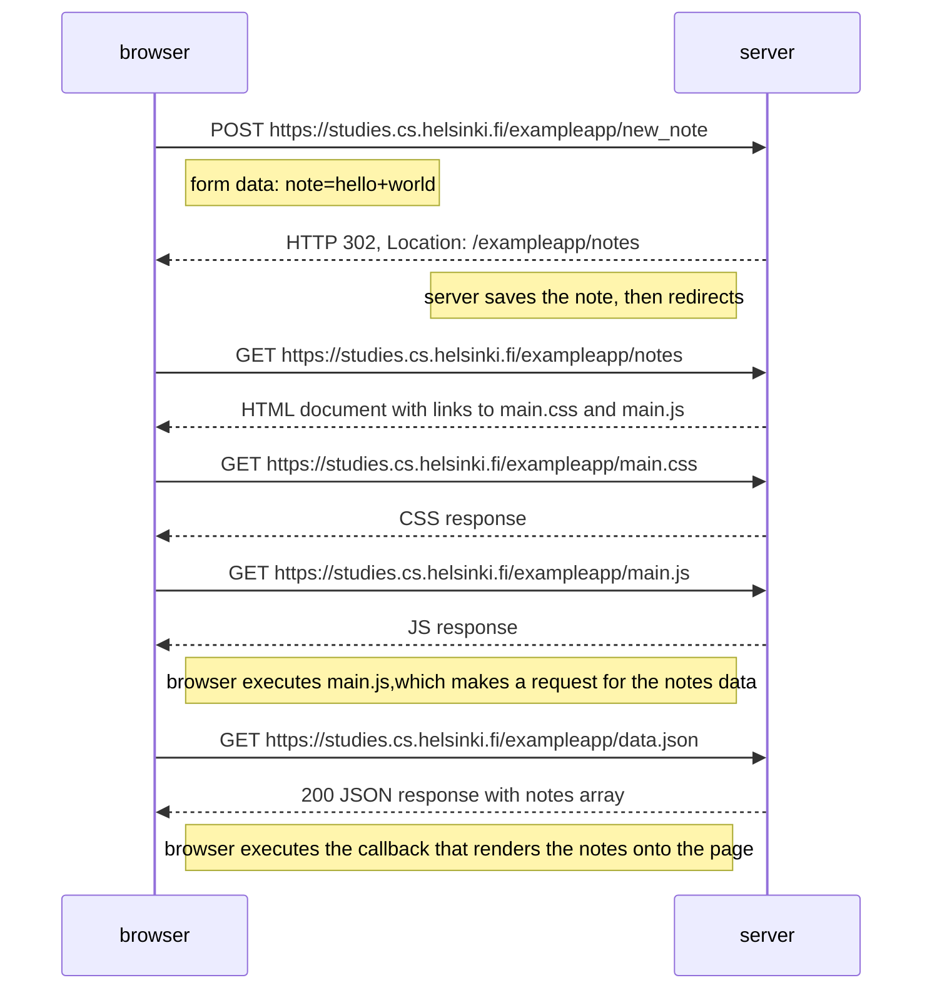

```mermaid
sequenceDiagram
    participant browser
    participant server

    browser->>server: POST https://studies.cs.helsinki.fi/exampleapp/new_note
    Note right of browser: form data: note=hello+world

    server-->>browser: HTTP 302, Location: /exampleapp/notes
    Note left of server: server saves the note, then redirects

    browser->>server: GET https://studies.cs.helsinki.fi/exampleapp/notes
    server-->>browser: HTML document with links to main.css and main.js

    browser->>server: GET https://studies.cs.helsinki.fi/exampleapp/main.css
    server-->>browser: CSS response

    browser->>server: GET https://studies.cs.helsinki.fi/exampleapp/main.js
    server-->>browser: JS response
    Note right of browser: browser executes main.js,which makes a request for the notes data

    browser->>server: GET https://studies.cs.helsinki.fi/exampleapp/data.json
    server-->>browser: 200 JSON response with notes array
    Note right of browser: browser executes the callback that renders the notes onto the page

```
