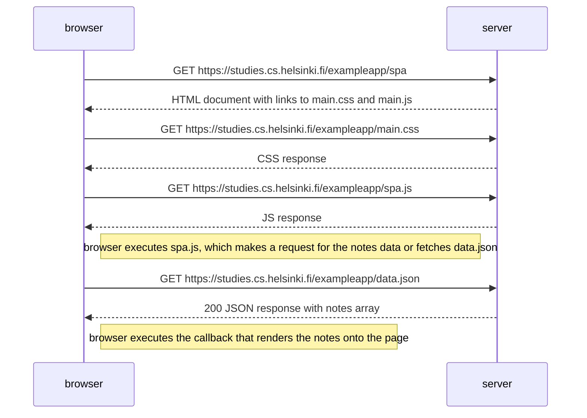

```mermaid
sequenceDiagram
    participant browser
    participant server
    browser->>server: GET https://studies.cs.helsinki.fi/exampleapp/spa
    server-->>browser: HTML document with links to main.css and main.js

    browser->>server: GET https://studies.cs.helsinki.fi/exampleapp/main.css
    server-->>browser: CSS response

    browser->>server: GET https://studies.cs.helsinki.fi/exampleapp/spa.js
    server-->>browser: JS response
    Note right of browser: browser executes spa.js, which makes a request for the notes data or fetches data.json

    browser->>server: GET https://studies.cs.helsinki.fi/exampleapp/data.json
    server-->>browser: 200 JSON response with notes array
    Note right of browser: browser executes the callback that renders the notes onto the page

```
