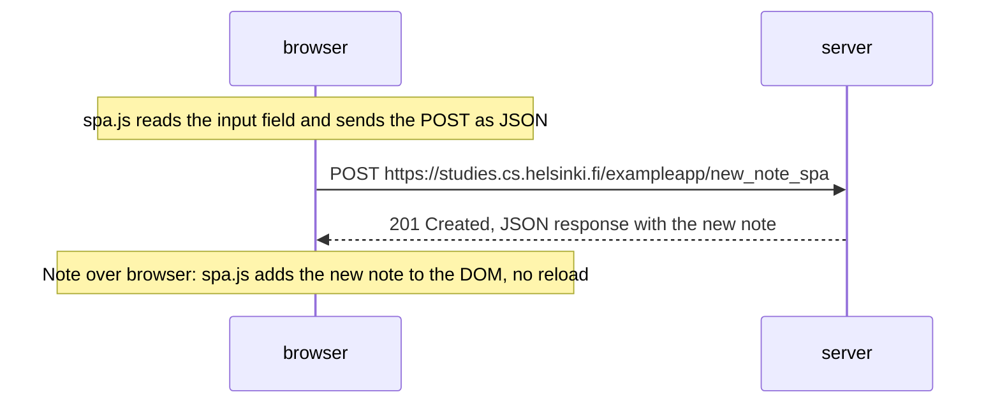

```mermaid
sequenceDiagram
    participant browser
    participant server

    Note over browser: spa.js reads the input field and sends the POST as JSON
    browser->>server: POST https://studies.cs.helsinki.fi/exampleapp/new_note_spa
    server-->>browser: 201 Created, JSON response with the new note
    Note over browser:Note over browser: spa.js adds the new note to the DOM, no reload
```
